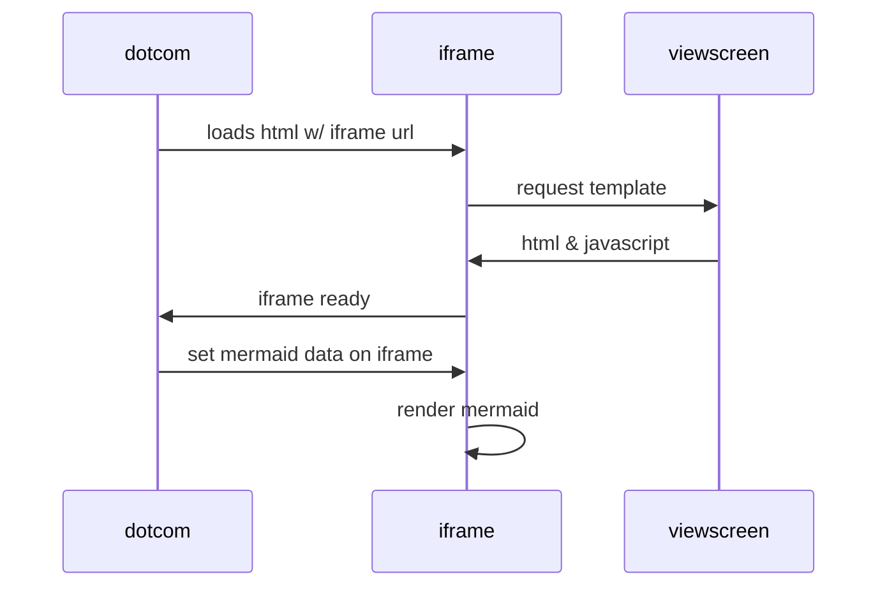

# testmd

  
Epcot Center

  
Epcot is a theme park at Walt Disney World Resort featuring exciting attractions, international pavilions, award-winning fireworks and seasonal special events.

 

Press <kbd>Ctrl</kbd> + <kbd>C</kbd> to copy text (Windows).

Press <kbd>Cmd</kbd> + <kbd>C</kbd> to copy text (Mac OS).
 

Jane Doe

Professor

20341 Whitworth Institute
405 N. Whitworth

Seattle,
WA
98052

(425) 123-4567
<a href="mailto:jane-doe@xyz.edu" itemprop="email">
jane-doe@xyz.edu</a>

Jane's home page:
<a href="http://www.janedoe.com" itemprop="url">janedoe.com</a>

Graduate students:
<a href="http://www.xyz.edu/students/alicejones.html" itemprop="colleague">
Alice Jones</a>
<a href="http://www.xyz.edu/students/bobsmith.html" itemprop="colleague">
Bob Smith</a>

## mermaid

